# AI-RPC Framework 架构设计文档

## Architecture Design Document

---

## 1. 系统整体架构图

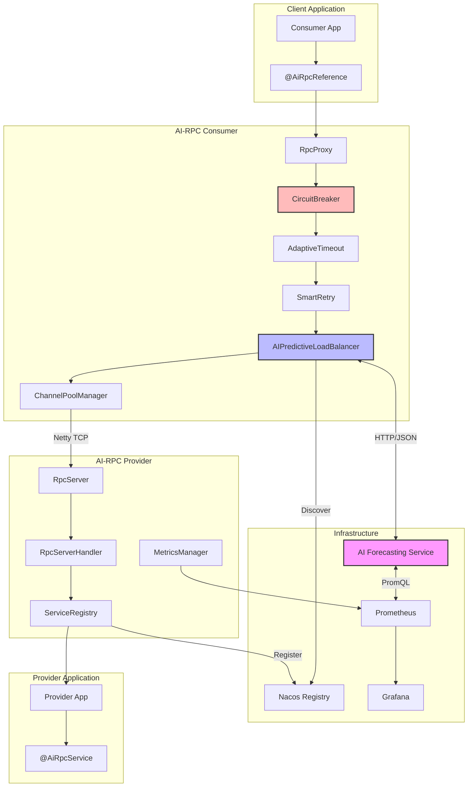

---

## 2. RPC调用完整流程图

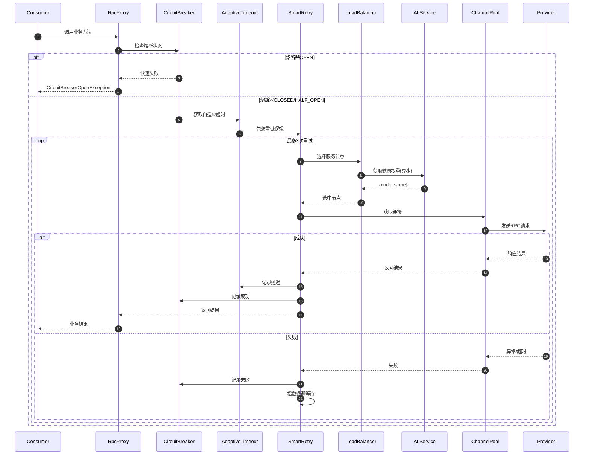

---

## 3. 模块架构详解

### 3.1 AI智能负载均衡模块

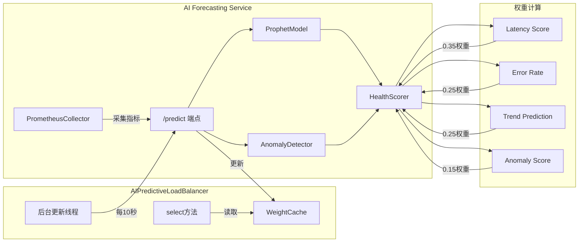

#### AI负载均衡流程

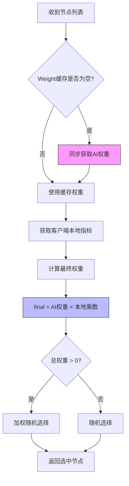

---

### 3.2 熔断器模块

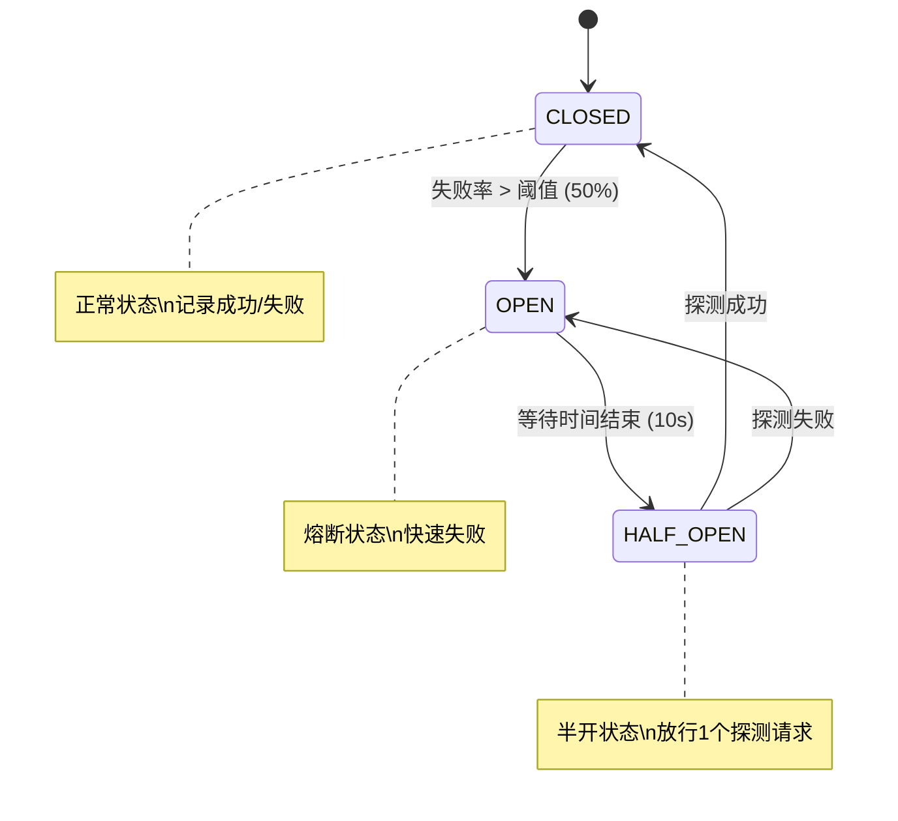

#### 熔断器组件结构

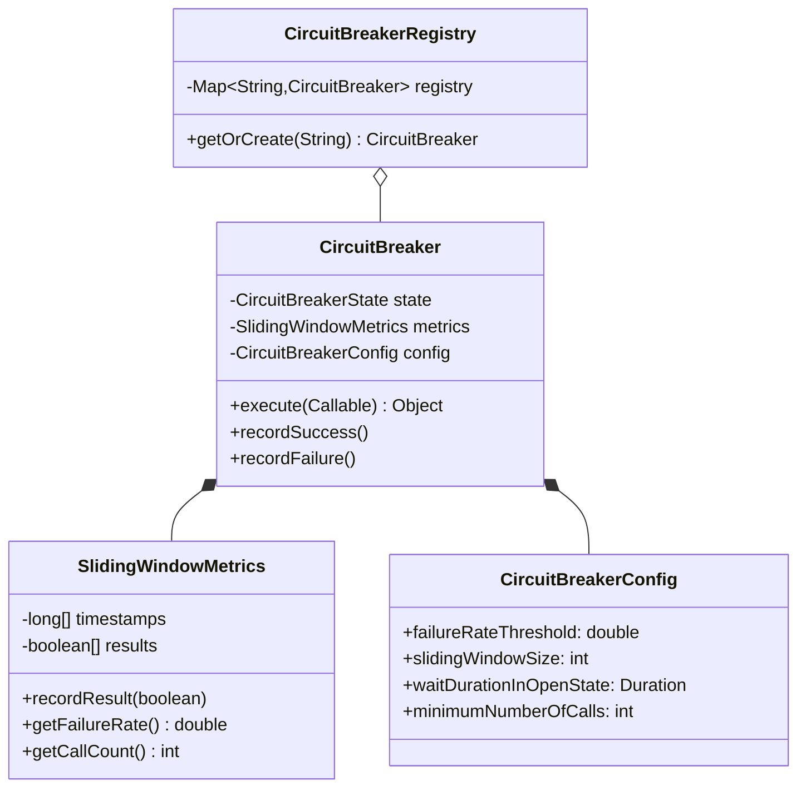

---

### 3.3 自适应超时模块

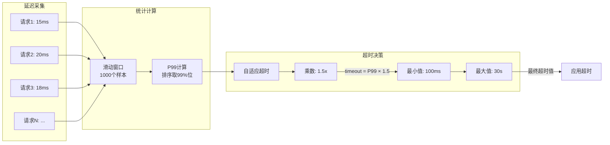

---

### 3.4 智能重试模块

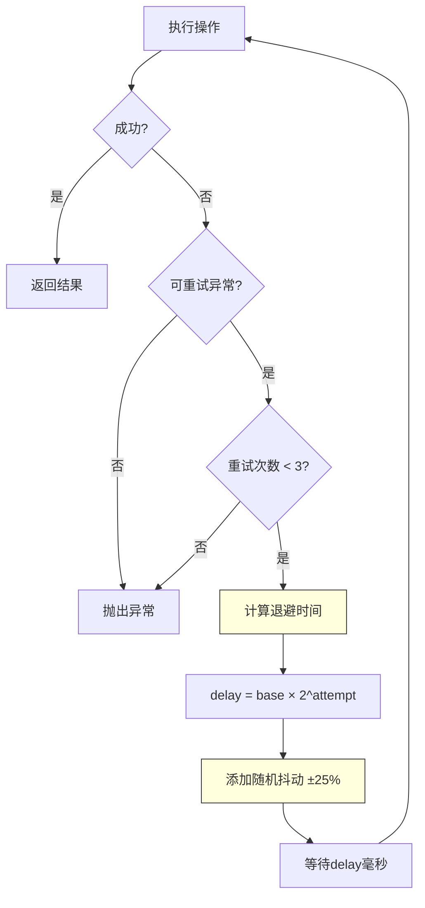

---

### 3.5 RPC通信协议

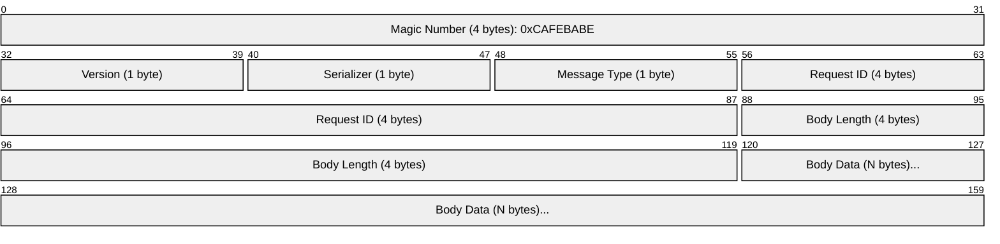

#### 消息类型

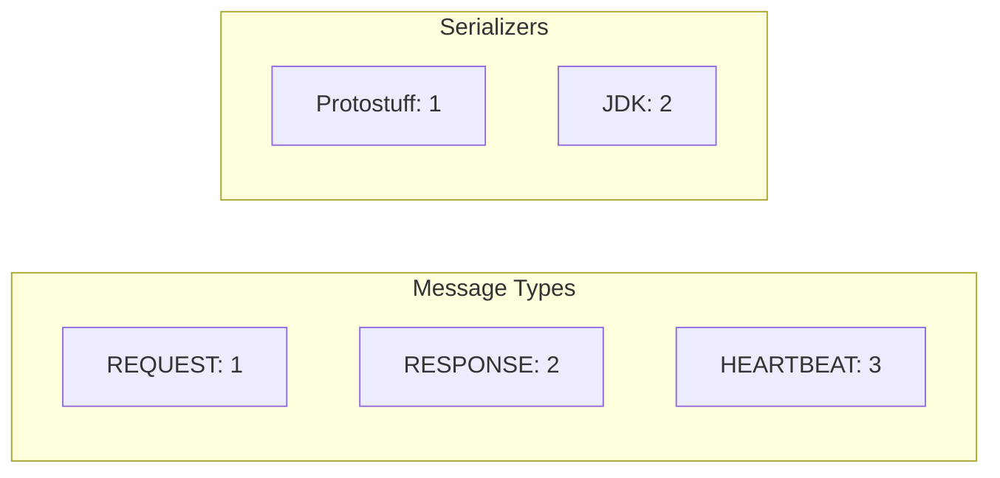

---

## 4. 数据流架构图

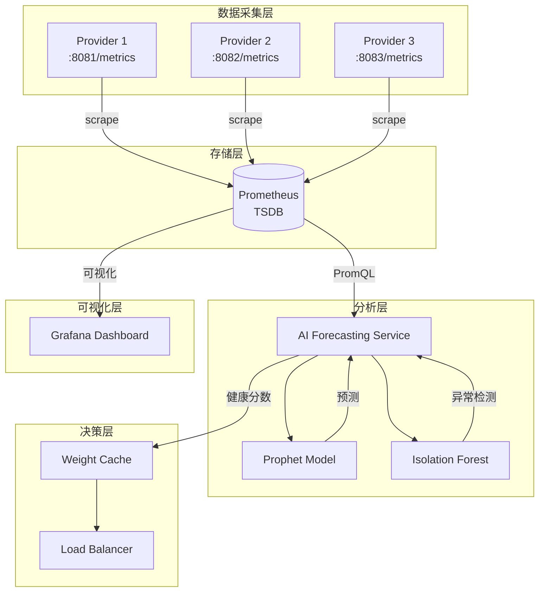

---

## 5. 部署架构图

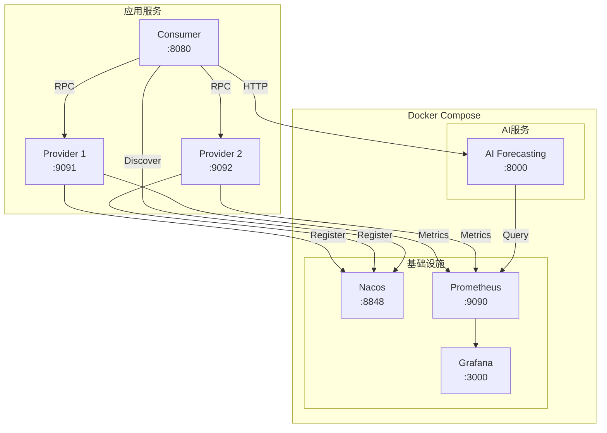

---

## 6. Spring Boot 集成架构

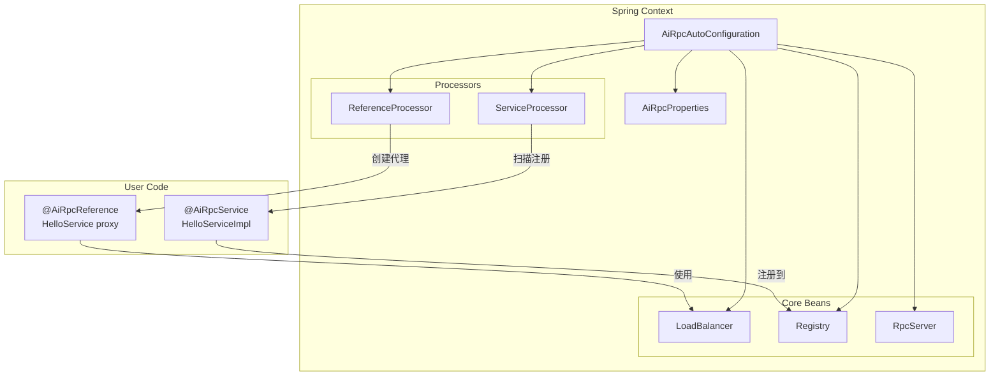

---

## 7. 故障处理流程

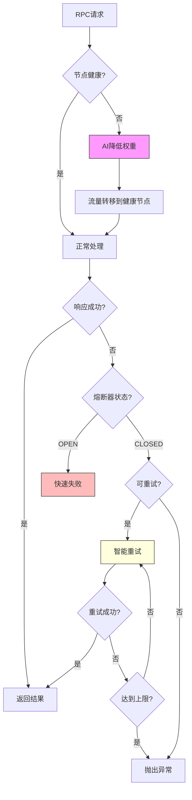

---

## 附录：模块依赖关系

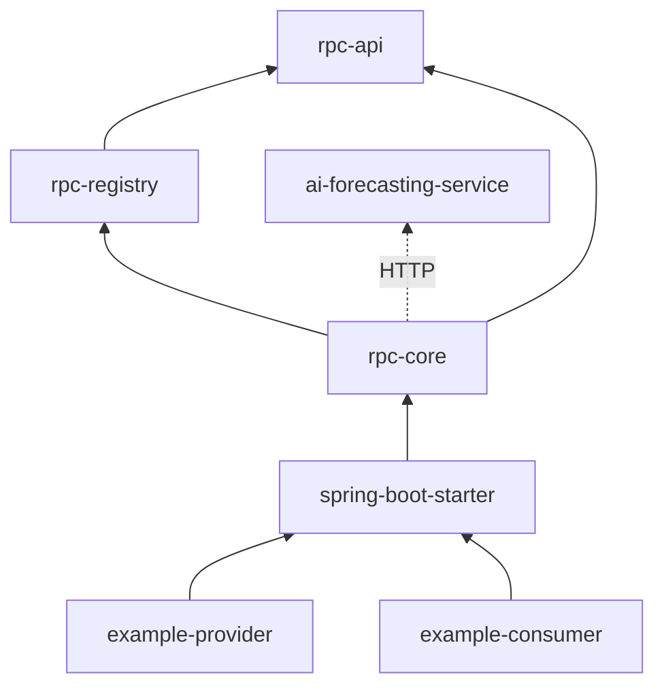
